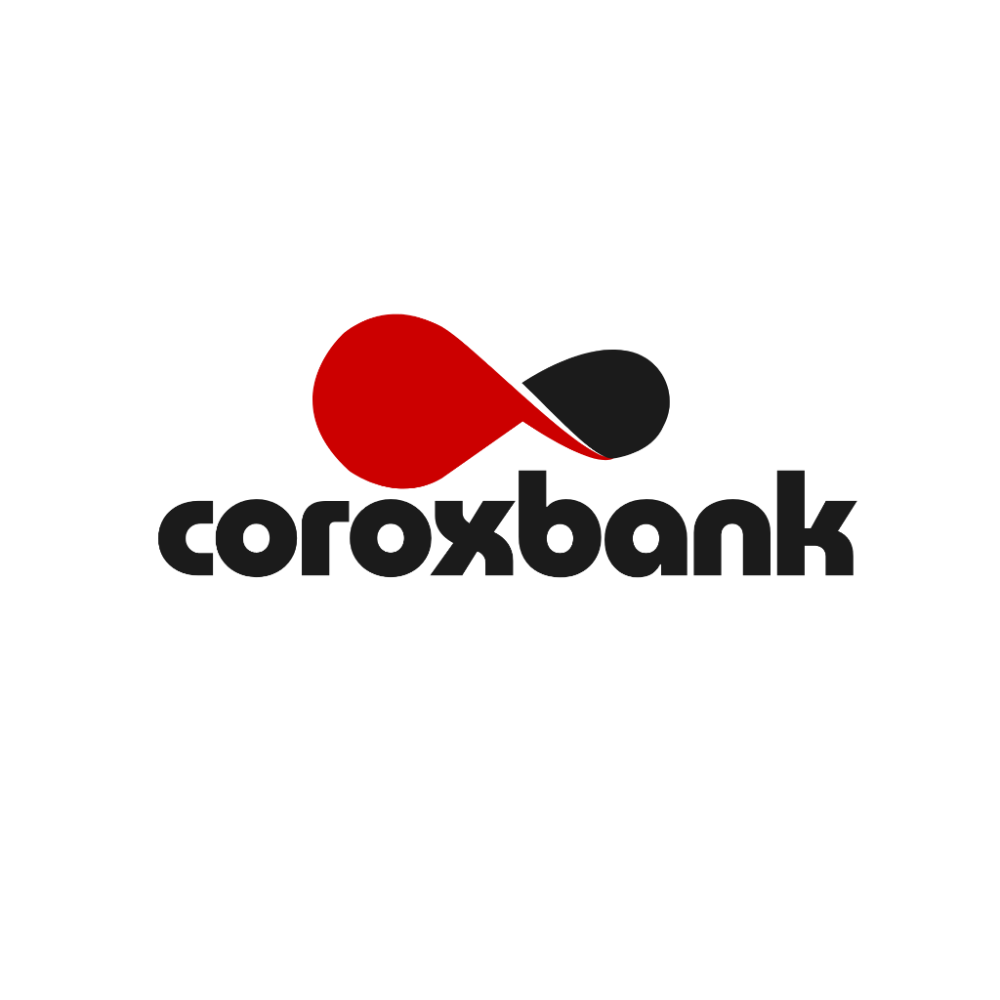

<p align="center">
  
</p>

<h1 align="center">Corox Commercial &amp; Digital Banking Platform</h1>

<p align="center">
  <strong>Next-generation commercial clearing, FedWire/ACH payment rails, institutional high-yield savings, and private wealth management.</strong>
</p>

<p align="center">
  
  
  
  
  
</p>

---

## 🏛️ Executive Summary

**Corox Bank** is an enterprise-grade full-stack digital banking web application built with Laravel and PHP 8. It features an institutional front-end inspired by the signature **Wells Fargo wireframe architecture**, Google Fonts typography (`Merriweather` serif + `Inter` sans-serif), live infinite ticker bar, Corox Crimson Red (`#CC0000`) and Carbon Onyx branding, comprehensive client and administrator portals, and direct simulated FedWire clearing.

- **Institution**: Corox Commercial Bank
- **ABA / FedWire Routing**: `026009593`
- **Deposit Insurance**: Member FDIC (Protected up to $250,000 per depositor)
- **Primary Color**: Corox Crimson (`#CC0000`)
- **Accent Palette**: Wells Fargo Stagecoach Gold (`#DDAA00` / `#FFB81C`) & Onyx Carbon (`#1B1B1B`)

---

## ✨ Features & Capabilities

### 🌐 Public Institutional Portal (Wells Fargo Architecture)
- **Top Segment Utility Bar**: Audiences separated into `Personal`, `Small Business`, `Commercial`, and `Wealth Management` with direct wire desk access.
- **Embedded Sign-On Hero**: Authentic Wells Fargo 2-column wireframe with direct quick-login card on the left and high-yield savings promotion on the right (**5.15% APY**).
- **Pure White Continuous Ticker**: Real-time market data (S&P 500, NASDAQ, DOW, Gold, 10-Yr Treasury) and institutional deposit rates.
- **6-Tile Action Wireframe Grid**: Rapid navigation for Checking, Savings, Credit Cards, Mortgages, Commercial Treasury, and Wealth Management.
- **Transparent Institutional Rate Sheet**: Interactive rate table comparing APYs, minimum opening balances, and deposit terms.
- **Split Product Showcases**: Dedicated sections highlighting Corox Infinite Metal Cards, 256-bit encryption, and federal regulatory compliance.
- **Corox Crimson Red Footer**: Full institutional footer with quick links, routing number, social media links, and regulatory FDIC disclosures.

### 💼 Client Banking Operations
- **Account Creation**: Instant application for Commercial Checking and High-Yield Savings accounts.
- **Fund Transfers**: Direct account-to-account and FedWire simulated wire transfers with automatic balance verification.
- **Deposits & Withdrawals**: Real-time balance updates with transaction ledger tracking.
- **Transaction Receipts**: Cryptographically hashed and formatted transaction receipts available for all client transfers.
- **Account Ledger**: Complete searchable and paginated history of all credits and debits.

### 🛡️ Administrative Portal
- **User Management**: View, inspect, and manage client profiles and statuses.
- **Account Approvals**: Granular administrative review to approve, hold, block, or unblock bank accounts.
- **Ledger Auditing**: Inspect user transaction histories and ledger movements.
- **Admin Cash Operations**: Administrative deposits, withdrawals, and inter-account corrections.

---

## 🛠️ Technical Stack

- **Backend**: [Laravel 8](https://laravel.com/) (MVC Architecture)
- **PHP**: PHP 8.2 / 8.3 (Compatible with standard PHP CLI)
- **Database**: SQLite (Zero configuration, lightweight, reliable)
- **Styling**: Vanilla CSS3 Design System (Modern CSS Grid, Flexbox, CSS Custom Properties, Google Fonts)
- **JavaScript**: Native ES6+ (Live market simulator, tab segmenter, responsive navigation)
- **Security**: CSRF protection, password hashing (Bcrypt), input sanitization, parameterized queries

---

## 🚀 Quickstart & Setup Guide

### 1. Prerequisites
- **PHP 8.1+** with `pdo_sqlite`, `mbstring`, `openssl`, `curl`, and `fileinfo` extensions enabled.
- **Composer** (optional for dependency updates).

### 2. Clone the Repository
```bash
git clone https://github.com/your-username/corox-bank.git
cd corox-bank
```

### 3. Environment Configuration
Copy the example environment file and generate the application key:
```bash
cp .env.example .env
php artisan key:generate
```

### 4. Database Setup & Seeding
The project uses SQLite for zero-friction setup:
```bash
# Create SQLite database file if not present
touch database/database.sqlite

# Run database migrations and seed default users
php artisan migrate --seed
```

### 5. Launch the Local Development Server
```bash
php artisan serve
```
Open your browser and navigate to: **`http://127.0.0.1:8000`**

---

## 🔐 Default Demo Credentials

The database is pre-seeded with test accounts for immediate evaluation:

| Role | Username | Password | Dashboard Access |
| :--- | :--- | :--- | :--- |
| **Administrator** | `admin` | `password123` | [http://127.0.0.1:8000/login](http://127.0.0.1:8000/login) |
| **Verified Client** | `client` | `password123` | [http://127.0.0.1:8000/login](http://127.0.0.1:8000/login) |
| **Test Client** | `john_doe` | `password123` | [http://127.0.0.1:8000/login](http://127.0.0.1:8000/login) |

---

## 📁 Project Architecture & Directory Map

```text
corox-bank/
├── app/
│   ├── Http/
│   │   ├── Controllers/       # UserController, AccountController, TransactionController
│   │   └── Middleware/        # Authentication & Role guards
│   └── Models/                # User, Account, Transaction Eloquent models
├── config/                    # Application, database, and auth configurations
├── database/
│   ├── factories/             # Model factories
│   ├── migrations/            # Schema definitions for users, accounts, and transactions
│   ├── seeders/               # Database seeder with pre-configured users
│   └── database.sqlite        # Portable local SQLite database
├── public/
│   ├── css/style.css          # Corox Bank Wells Fargo CSS Design System
│   └── images/                # Corox logos, cards, building hero, and security vault
├── resources/
│   └── views/
│       ├── layouts/           # public.blade.php & app.blade.php
│       ├── personal.blade.php # Personal banking products
│       ├── cards.blade.php    # Corox Infinite Metal Cards
│       ├── loans.blade.php    # Mortgages and commercial lines of credit
│       ├── business.blade.php # Corporate treasury & ACH
│       ├── wealth.blade.php   # Private wealth management
│       ├── security.blade.php # FDIC protection & security center
│       ├── welcome.blade.php  # Wells Fargo signature homepage wireframe
│       └── ...                # Client & Admin dashboards
├── routes/
│   └── web.php                # Web routes & route definitions
└── .env.example               # Template environment configuration
```

---

## ⚖️ Regulatory & Legal Disclosures

- **FDIC Insurance**: Deposits are insured up to $250,000 per depositor, per insured bank, for each account ownership category.
- **Routing**: Official simulated FedWire/ACH transit routing number: `026009593`.
- **Equal Housing Lender**: Corox Bank complies with federal fair lending regulations.

---

<p align="center">
  &copy; 2026 Corox Bank. All Rights Reserved. Member FDIC.
</p>
